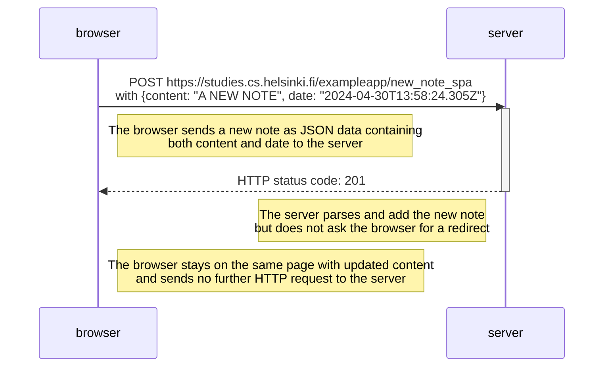

```mermaid
sequenceDiagram
    participant browser
    participant server

    browser->>server: POST https://studies.cs.helsinki.fi/exampleapp/new_note_spa <br/> with {content: "A NEW NOTE", date: "2024-04-30T13:58:24.305Z"}
    activate server

    Note right of browser: The browser sends a new note as JSON data containing <br/> both content and date to the server

    server-->>browser: HTTP status code: 201
    deactivate server
    Note left of server: The server parses and add the new note <br/> but does not ask the browser for a redirect

    Note right of browser: The browser stays on the same page with updated content <br/> and sends no further HTTP request to the server

```
